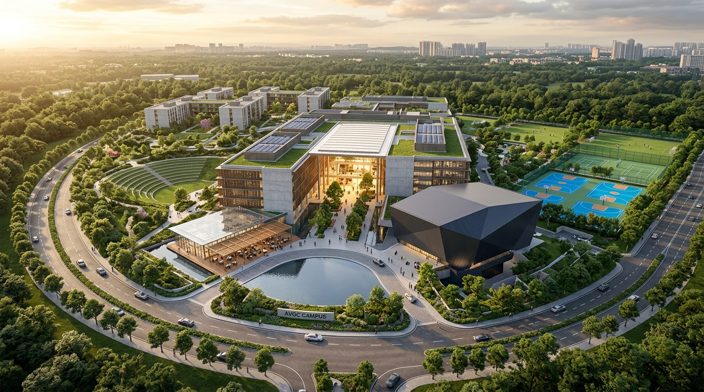
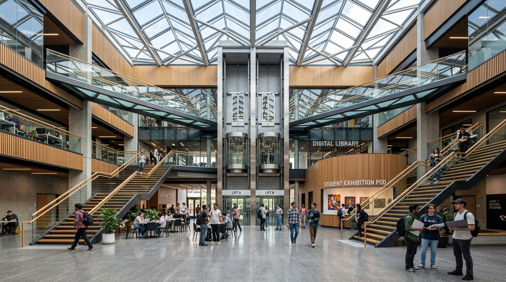
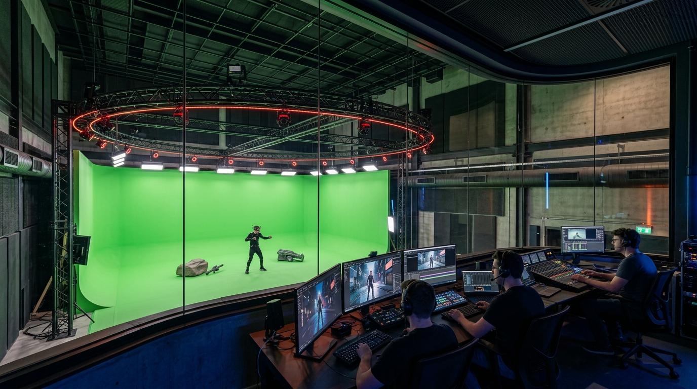
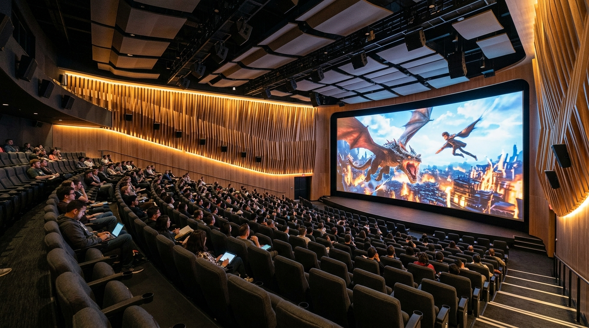

# AVGC Center of Excellence (25,000 m² Campus)
### Interactive 3D Architectural Visualizer & Masterplan

An interactive, browser-based 3D architectural visualization platform for a proposed state-of-the-art **AVGC (Animation, Visual Effects, Gaming, and Comic Design) Center of Excellence** spanning a 25,000 m² landscaped plot.

The model strictly adheres to the architectural floor plans, sections, and site masterplan drawings while incorporating contemporary institutional design, PBR materials, dynamic day/sunset/night solar lighting, exploded floor-by-floor exploration, first-person walkthrough, and real-time room inspection.

---

## 🏛 Master Architectural Perspectives

*Full 25,000 m² Campus Aerial Masterplan: Academic Quadrangle, Faceted 500-Seat Auditorium, Cafeteria Pavilion, Arrival Plaza with Reflecting Pool, Stepped Amphitheater, Sports Complex, and Residential Hostels.*

| Grand Central Skylit Atrium | High-Tech MoCap Studio |
| :---: | :---: |
|  |  |
| *Scenic glass lifts, skybridges, space-frame skylight & digital library.* | *Double-height volume, 24-camera optical tracking rig & control booth.* |

| 500-Seat Screening & Preview Auditorium |
| :---: |
|  |
| *Raked tiered cinema seating, 4K curved screen & Dolby Atmos baffles.* |

---

## 📐 Key Campus Program Metrics

- **Plot Area**: 25,000 m² (150.0m × 166.7m)
- **Academic Population**: 920 Students • 46 Faculty
- **Dedicated Studios**: 24 Specialized Studio Labs (VFX, Game Design, Comic Design)
- **Key Public Facilities**:
  - 500-Seat Screening & Preview Auditorium (500 m²)
  - Double-Height Central Library & Digital Commons (300 m²)
  - Incubation & Co-Working Hub (300 m²)
  - Cafeteria & Student Lounge with Pergola Dining (540 m²)
  - Exhibition / Showcase Gallery (300 m²)
- **Advanced Production Wing**:
  - High-Ceiling Motion Capture Studio (216 m², 8.4m clear height)
  - Tier-3 Clustered Render Farm / Data Centre (72 m²)
  - VR / AR Innovation Lab (108 m²)
- **Residential Village**:
  - 2 Student Hostel Courtyard Blocks (320 Residents, G+3)
  - 3 Faculty & Staff Housing Villas (24 Family Apartments, G+2)
- **Landscape & Athletics**:
  - Circular Arrival Plaza with Tiered Reflecting Water Feature (24m diameter)
  - Stepped Grass Outdoor Amphitheater (350 capacity)
  - Multi-Sport Arena (Basketball Court + Twin Tennis/Badminton Courts + Floodlights)

---

## 🚀 How to Enable GitHub Pages (Make It Live in 30 Seconds)

1. Go to your repository on **GitHub.com**.
2. Click on **Settings** (gear icon at the top).
3. In the left navigation menu, click **Pages**.
4. Under **Build and deployment** > **Branch**:
   - Select `main` (or `master`).
   - Select `/ (root)`.
   - Click **Save**.
5. Wait 30–60 seconds, and GitHub will provide your live URL:
   `https://<your-username>.github.io/<your-repo-name>/`

---

## 💻 Interactive Features Built-In

- **Orbit Controls**: Rotate, pan, and zoom smoothly across the 25,000 m² masterplan.
- **Walk Mode (W, A, S, D)**: First-person eye-level pedestrian walkthrough across plazas, courtyards, and corridors.
- **Guided Fly-Through Tour**: Automated cinematic tour stopping at the 8 key architectural highlights.
- **Interactive Space Inspector**: Click any room or building to highlight it with an architectural wireframe and view live metadata (area in m², dimensions, occupancy, tech equipment).
- **Exploded Floor View**: Slider separating Roof, Level 1, and Ground Floor to inspect interior layouts.
- **Sunlight & Time-of-Day Slider**: 06:00 to 22:00 simulation with realistic shadows and night illumination.
- **3D Model Export**: One-click OBJ download for use in **Blender, 3ds Max, SketchUp, Rhino, or Revit**.
